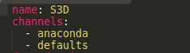
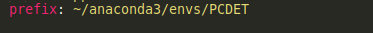

# 3D Detection Stereo Based

This repository containt a real time 3d depth estmiation using stereo camera on [KITTI Benchmark](http://www.cvlibs.net/datasets/kitti/)

## Dependencies

- [CUDA >= 10.0](https://developer.nvidia.com/Cuda-Toolkit)
- [Pytorch >= 1.0](https://pytorch.org/)
- [cuDNN](https://docs.nvidia.com/deeplearning/cudnn/)
- Linux/Mac/Widnows

## Installation

1. you must install CUDA local on your system environment, follow this [link](https://developer.nvidia.com/Cuda-downloads)
2. you must instakk cuDNN local in your system environment, follow this [link](https://docs.nvidia.com/deeplearning/cudnn/install-guide/index.html)
3. you should build a specific environment so we recommend to install [anaconda](https://docs.anaconda.com/anaconda/install/)
4. Install the dependencies for demos and visualizaiotn, we make a [yml](env.yml) file which contains all the required packages
	
	- Download the yml file on your hard disk
	- Open the file and change the name in the first line for your environment, i have PCDET name for me

	

	- In the same file at the last line change it to your path tp install the environment then save the file

	

	- `CD` to the path that you have downloaded the file and open terminal and run this command
		```shell script
		conda env create -f env.yml
		```
	- Then activate your environment using `conda activate ${env_name}`
5. you need to install [spconv](https://github.com/traveller59/spconv) in your environment
	
	- `git clone https://github.com/traveller59/spconv.git --recursive`
	- `sudo apt-get install libboost-all-dev`
	- `cd spconv`
	- `python setup.py bdist_wheel`
	- `cd ./dist`
	- `pip install spconv*.whl`
6. you need to install [pcdet](https://github.com/open-mmlab/OpenPCDet) in your hard disk
	
	- `git clone https://github.com/open-mmlab/OpenPCDet.git`
	- `cd OpenPCDet`
	- `python setup.py develop`


## Demo
