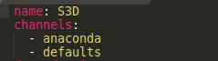
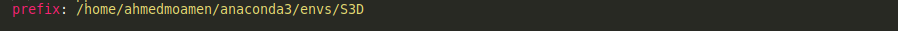

# 3D Detection Stereo Based

This repository containts a real time **3D depth estmiation** using stereo camera on [KITTI Benchmark](http://www.cvlibs.net/datasets/kitti/)

## Dependencies

- [CUDA >= 10.0](https://developer.nvidia.com/Cuda-Toolkit)
- [Pytorch >= 1.0](https://pytorch.org/)
- [cuDNN](https://docs.nvidia.com/deeplearning/cudnn/)
- Linux/Mac/Widnows

## Installation

NOTE: this installlation is compatible with linux only, nearly will support windows

1. you must install CUDA local on your system environment, follow this [link](https://developer.nvidia.com/Cuda-downloads)
2. you must instakk cuDNN local in your system environment, follow this [link](https://docs.nvidia.com/deeplearning/cudnn/install-guide/index.html)
3. you should build a specific environment so we recommend to install [anaconda](https://docs.anaconda.com/anaconda/install/)
4. Install the dependencies for demos and visualizaiotn, we make a [yml](env_linux.yml) file which contains all the required packages
	
   - Download the yml file on your hard disk
   - Open the file and change the name in the first line for your environment, i have S3D name for me

     

   - In the same file at the last line change it to your path tp install the environment then save the file

	 

   - `CD` to the path that you have downloaded the file and open terminal and run this command

	 ```shell script
	 conda env create -f env.yml
	 ```
   - Then activate your environment using `conda activate ${env_name}`
   - `cd AnyNet/models/spn_t1/ && bash make.sh`
   - `pip install --no-binary opencv-python opencv-python`

5. you need to install [spconv](https://github.com/traveller59/spconv) in your environment
	
   - `git clone https://github.com/traveller59/spconv.git --recursive`
   - `sudo apt-get install libboost-all-dev`
   - `cd spconv`
   - `python setup.py bdist_wheel`
   - `cd ./dist`
   - `pip install spconv*.whl`

6. you need to install [pcdet](https://github.com/open-mmlab/OpenPCDet) in your hard disk
	
   - `git clone https://github.com/open-mmlab/OpenPCDet.git`
   - `cd OpenPCDet`
   - Copy the pcdet folder and `setup.py` file to **Stereo-3D-Detection**
   - `python setup.py develop`


## Dataset Preparation

You need to make data directory first and construct dataset as following

```
Stereo-3D-Detection
├── data
│   ├── kitti
│   │   │── training
│   │   │   ├──calib & velodyne & label_2 & image_2 & image_3 & (optional: planes)
│   │   │── testing
│   │   │   ├──calib & velodyne & image_2 & image_3
├── pcdet
├── configs
├── utils
├── .
├── .
├── .
```
- run this command to generate fata infos
```python
python -m pcdet.datasets.kitti.kitti_dataset create_kitti_infos configs/cfgs/dataset_configs/kitti_dataset.yaml
```

- link for [planes](https://drive.google.com/file/d/1d5mq0RXRnvHPVeKx6Q612z0YRO1t2wAp/view?usp=sharing)


## Checkpoints Preparation

You can download all checkpoints from this [README.md](https://github.com/open-mmlab/OpenPCDet)

```
Stereo-3D-Detection
├── configs
│   ├── cfgs
│   │   │── dataset_configs
│   │   │── kitti_models
│   │   │── nuscenes_models
│   │   │── waymo_models
│   ├── checkpoint
│   │   │── 3D_Detection
│   │   │   ├──pointpillar_7728.pth & pv_rcnn_8369.pth & ... etc
│   │   │── kitti2012_ck
│   │   │── kitti2015_ck
│   │   │── sceneflow
├── pcdet
├── configs
├── utils
├── .
├── .
├── .
```

NOTE: keep its file name


## Demo

- To go from stereo to 3D object detection

```shell script
python full_demo.py --index 0
```

- index is the corresponing to which sample in the dataset, default is 0

- To go from point cloud to 3D object detection

```shell script
python pointcloud_demo.py
```
